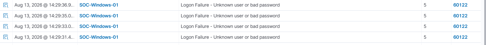
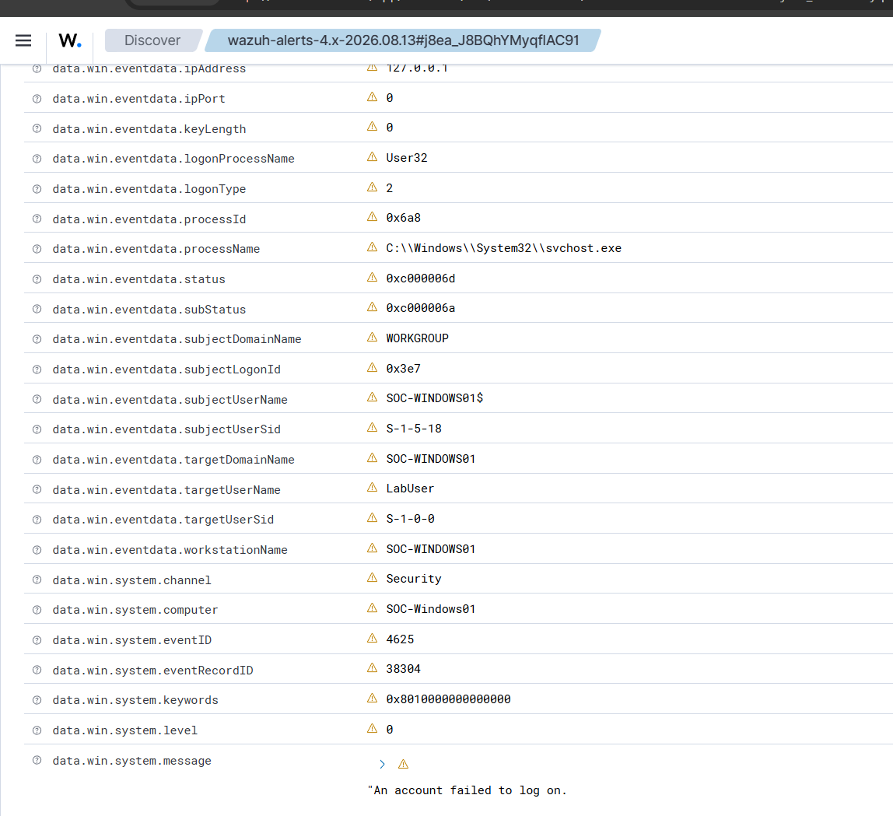

# Investigation 01: Failed Windows Authentication

## Overview

This investigation simulates failed Windows authentication attempts and analyzes the resulting security telemetry in Wazuh.

The goal was to practice identifying authentication failures, reviewing Windows Security events, and determining the cause of the activity.

## Scenario

Multiple failed login attempts were generated against a local Windows account named `LabUser` on the monitored Windows 11 endpoint.

## Detection

Wazuh generated alerts for:

- **Rule:** Logon Failure - Unknown user or bad password
- **Wazuh Rule ID:** 60122
- **Rule Level:** 5
- **Windows Event ID:** 4625

## Investigation

I reviewed the alert details in Wazuh and identified:

- Target account: `LabUser`
- Endpoint: `SOC-Windows-01`
- Event ID: `4625`
- Logon Type: `2`
- Source IP: `127.0.0.1`
- Authentication Package: `Negotiate`
- Failure Reason: `%%2313`
- Status: `0xC000006D`
- SubStatus: `0xC000006A`

## Analysis

The event indicated an interactive logon attempt (`Logon Type 2`) originating locally from the Windows endpoint.

The status codes indicated that the authentication attempt failed because an incorrect password was supplied for the account.

Multiple Event ID 4625 events occurring within a short period could warrant further investigation for password guessing or brute-force activity.

## MITRE ATT&CK

**T1110 – Brute Force**

Repeated authentication failures can be associated with attempts to obtain access by guessing account credentials.

> Note: In this controlled lab, the failed authentication attempts were intentionally generated and do not represent an actual attack.

## Conclusion

The activity was determined to be expected test activity generated as part of the SOC lab.

This investigation demonstrated the process of identifying a Wazuh authentication alert, analyzing Windows Event ID 4625 telemetry, reviewing authentication failure codes, and determining the likely cause of the failed logon attempts.
