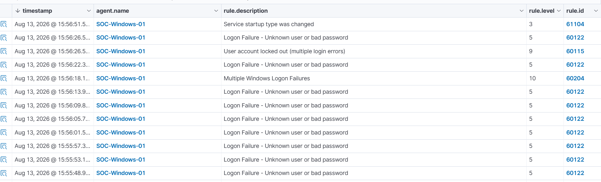
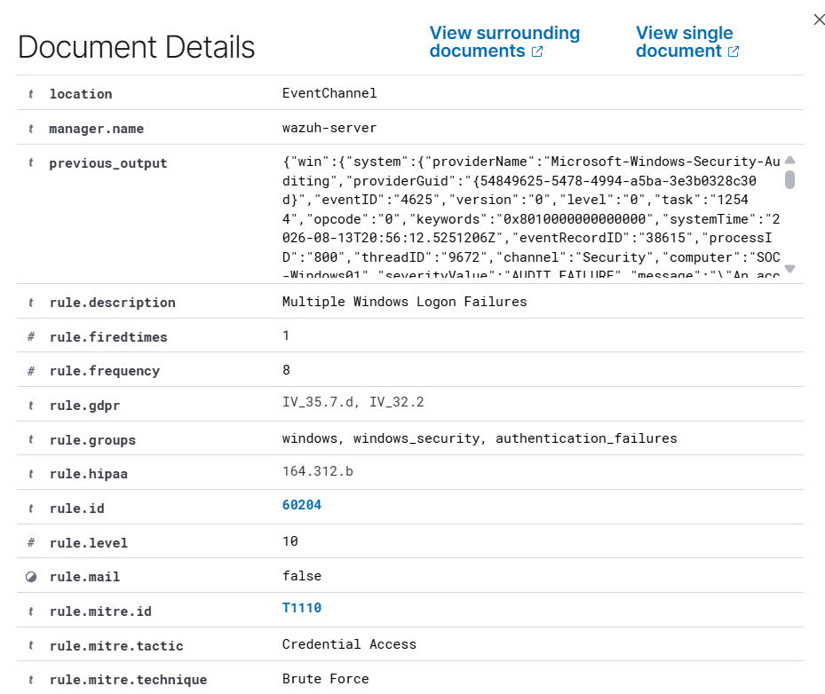
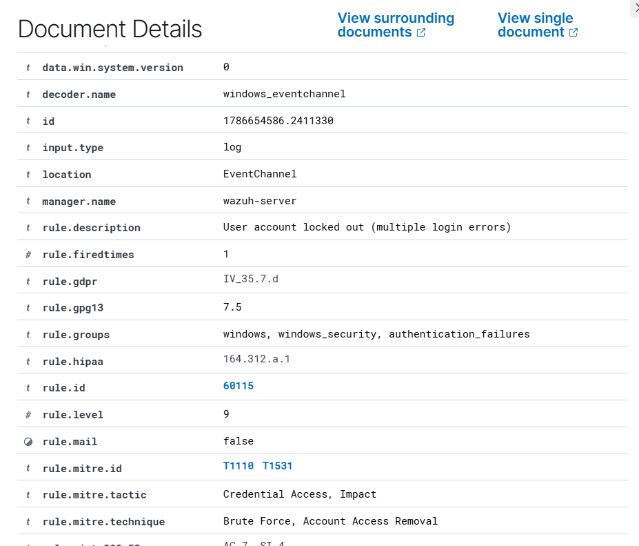

# 🔐 Brute Force Detection & Account Lockout Investigation

## Overview

This investigation simulates repeated failed authentication attempts against a Windows 11 endpoint to observe how Wazuh detects potential brute-force activity.

The objective was to analyze the sequence of authentication failures, identify Wazuh's brute-force detection, correlate the activity with MITRE ATT&CK, and observe the resulting account lockout.

---

## Scenario

Multiple incorrect passwords were intentionally entered for the local Windows account `LabUser` on the monitored endpoint `SOC-Windows-01`.

The repeated authentication failures eventually triggered Wazuh's brute-force detection and caused Windows to lock the account.

---

## Detection

Wazuh detected several security events during the activity.

| Alert | Wazuh Rule ID | Level |
|---|---:|---:|
| Logon Failure - Unknown user or bad password | 60122 | 5 |
| Multiple Windows Logon Failures | 60204 | 10 |
| User account locked out (multiple login errors) | 60115 | 9 |

The individual failed authentication attempts were recorded as Windows Security Event ID `4625`.

---

## Investigation

I reviewed the sequence of alerts in Wazuh and identified repeated failed authentication attempts against `LabUser`.

The failed attempts occurred within a short period and were correlated by Wazuh into a higher-severity **Multiple Windows Logon Failures** alert.

Key findings:

- **Endpoint:** `SOC-Windows-01`
- **Target account:** `LabUser`
- **Windows Event ID:** `4625`
- **Authentication package:** `NTLM`
- **Logon type:** `3`
- **Source IP:** `127.0.0.1`
- **Wazuh brute-force rule:** `60204`
- **Rule level:** `10`

---

## MITRE ATT&CK Mapping

Wazuh mapped the multiple-login-failure activity to:

- **Technique:** T1110 - Brute Force
- **Tactic:** Credential Access

The repeated authentication failures are consistent with behavior that could indicate an attempt to obtain access to an account by repeatedly guessing credentials.

---

## Account Lockout

Following the repeated failed authentication attempts, Windows locked the `LabUser` account.

Wazuh detected the lockout with:

- **Rule:** User account locked out (multiple login errors)
- **Rule ID:** `60115`
- **Rule Level:** `9`
- **Windows Event ID:** `4740`
- **Target Account:** `LabUser`

The lockout provides an additional indicator that a high number of unsuccessful authentication attempts occurred against the account.

---

## Analysis

The sequence of events showed a clear progression:

**Repeated failed logins → Multiple logon failure detection → Account lockout**

In a production SOC environment, this activity would warrant further investigation to determine whether the failures were caused by a legitimate user, a misconfigured application or service, or malicious credential-guessing activity.

Because the activity in this lab originated locally and was intentionally generated, it was determined to be expected test activity rather than an actual compromise.

---

## Conclusion

This investigation demonstrated how repeated Windows authentication failures can be detected and correlated using Wazuh.

The investigation also demonstrated how individual Windows Event ID `4625` events can develop into a higher-severity brute-force alert and ultimately an account lockout event.

### Skills Practiced

- SIEM alert triage
- Windows Security Event analysis
- Authentication log analysis
- Event correlation
- Brute-force detection
- MITRE ATT&CK mapping
- SOC investigation documentation
