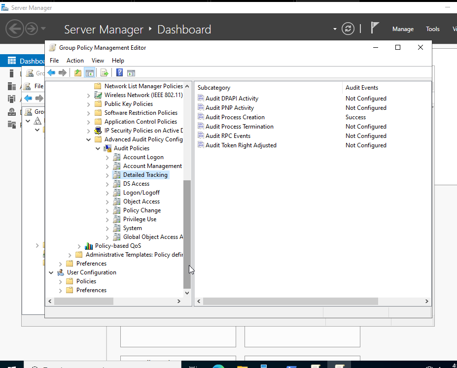
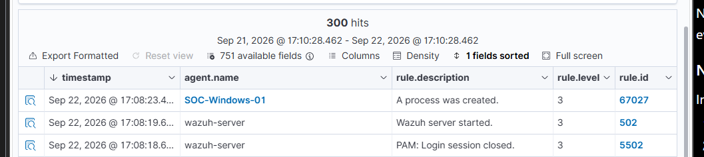
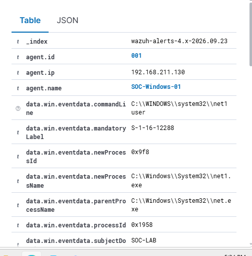

# Investigation 03: Windows Process Creation & Account Discovery

## Investigation Summary

**Endpoint:** SOC-Windows-01  
**Domain:** SOC-LAB.local  
**SIEM:** Wazuh  
**Windows Event ID:** 4688  
**Wazuh Rule ID:** 67027  
**Activity:** Account Discovery  
**Command:** `net user`  
**Disposition:** Benign - Lab Activity  

---

## Objective

The objective of this investigation was to configure Windows process creation
auditing, forward the resulting security events to Wazuh, and analyze process
activity from a domain-joined Windows workstation.

I also enabled command-line logging to provide additional context during
investigations, allowing me to see not only which executable was launched,
but also the arguments supplied to the process.

---

## Lab Environment

The investigation was performed in my SOC home lab using:

- Windows Server 2022 Domain Controller
- Windows 11 workstation (`SOC-Windows-01`)
- Active Directory Domain Services
- Group Policy
- Wazuh SIEM
- VMware
- Domain: `SOC-LAB.local`

---

## Process Creation Auditing Configuration

To improve endpoint visibility, I created a Group Policy Object named
`SOC Security Auditing`.

I enabled successful process creation auditing using:

`Computer Configuration → Policies → Windows Settings → Security Settings →
Advanced Audit Policy Configuration → Audit Policies → Detailed Tracking →
Audit Process Creation`

The policy was configured to audit successful process creation events.

### Screenshot - Process Creation Auditing

*Figure 1: Group Policy configured to audit successful process creation events.*

After applying the policy to the workstation, I verified that Process Creation
auditing was enabled using:

`auditpol /get /subcategory:"Process Creation"`

Windows reported the auditing status as `Success`.

---

## Enabling Command-Line Logging

Initially, Windows Event ID 4688 showed which processes were being created,
but the command-line arguments were not included.

To provide additional context, I enabled:

`Computer Configuration → Policies → Administrative Templates → System →
Audit Process Creation → Include command line in process creation events`

I then updated Group Policy on `SOC-Windows-01` using:

`gpupdate /force`

This allowed Event ID 4688 to record the command line associated with newly
created processes.

---

## Generating Test Activity

To test the new auditing configuration, I executed the following command on
`SOC-Windows-01`:

`net user`

The `net user` command displays information about user accounts on a Windows
system.

Although this command has legitimate administrative uses, similar commands
may also be used during reconnaissance to identify accounts available on a
compromised system.

---

## Detection in Wazuh

After executing the command, I reviewed events from `SOC-Windows-01` in
Wazuh Threat Hunting.

Wazuh generated an alert with the following information:

- **Rule ID:** 67027
- **Rule Description:** A process was created.
- **Rule Level:** 3
- **Windows Event ID:** 4688
- **Event Channel:** Security

### Screenshot - Wazuh Process Creation Alert

*Figure 2: Wazuh receiving Windows Event ID 4688 process creation telemetry
from SOC-Windows-01.*

This confirmed that Windows Security events were successfully being collected
by the Wazuh agent and forwarded to the Wazuh server.

---

## Investigation and Analysis

I opened the process creation event in Wazuh and reviewed the process and
command-line information.

The event contained:

- **New Process:** `C:\Windows\System32\net1.exe`
- **Parent Process:** `C:\Windows\System32\net.exe`
- **Command Line:** `C:\WINDOWS\system32\net1 user`
- **Domain:** `SOC-LAB`

### Screenshot - Command-Line Evidence

*Figure 3: Wazuh event details showing net.exe spawning net1.exe with the
`user` argument.*

The telemetry showed that `net.exe` spawned `net1.exe`, which executed with
the `user` argument.

The process relationship observed was:

`net.exe → net1.exe → "net1 user"`

Command-line logging provided important additional context. Without the
command-line field, the event would only show that `net1.exe` executed.
With command-line auditing enabled, I could determine that the process was
being used to enumerate user accounts.

---

## Analyst Assessment

The observed activity was expected because I intentionally executed the
command as part of the lab.

**Disposition: Benign / Lab Activity**

However, if this event appeared unexpectedly in a production environment,
I would investigate additional context before determining whether the
activity was malicious.

I would review:

- The user account that executed the command
- The parent process responsible for launching `net.exe`
- Other commands executed around the same time
- Authentication activity associated with the user
- Other processes created on the endpoint
- Whether this behavior is normal for the affected user or workstation
- Related activity on other endpoints

The presence of `net user` alone would not be enough to classify the activity
as malicious because the command also has legitimate administrative uses.

---

## Conclusion

This investigation demonstrated the complete process of configuring,
generating, collecting, and analyzing Windows process creation telemetry.

I configured Windows Event ID 4688 auditing through Group Policy, enabled
command-line logging, generated account discovery activity, and investigated
the resulting event in Wazuh.

The lab provided hands-on experience with:

- Windows Security Event Logs
- Event ID 4688
- Active Directory
- Group Policy
- Wazuh SIEM
- Process and parent-process analysis
- Command-line analysis
- Windows account discovery
- Security monitoring
- SOC investigation methodology
